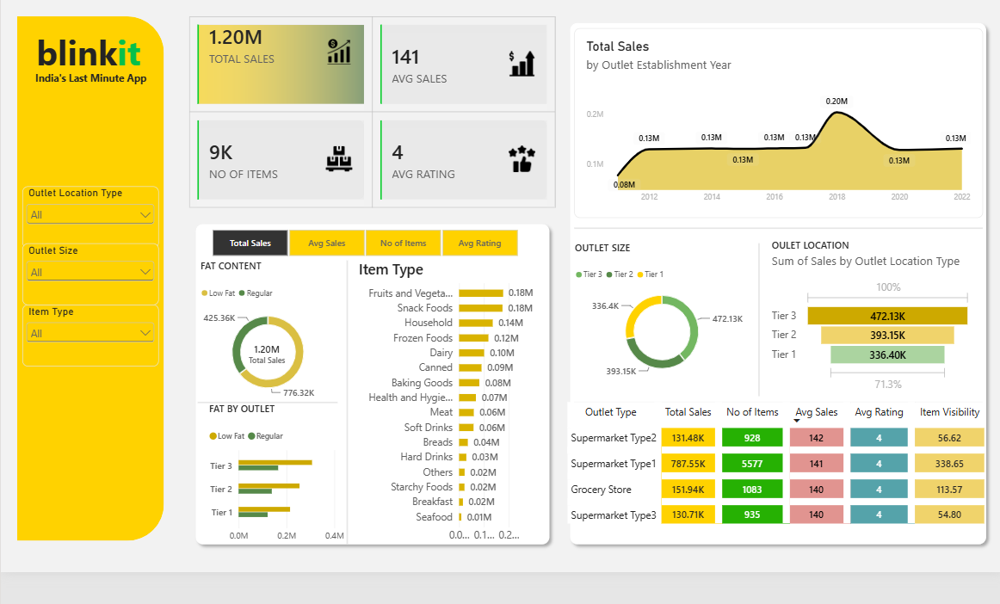

# Blinkit_Sales_Analysis_POWERBI

##  Project Overview

This project is an interactive Blinkit Sales Analysis Dashboard created using Microsoft Power BI.

The dashboard provides insights into sales performance, item categories, outlet types, outlet sizes, outlet locations, and customer ratings.

##  Project Objectives

- Analyze overall sales performance
- Track key business KPIs
- Compare sales across different outlet types and sizes
- Analyze sales by item category
- Understand outlet performance based on location and size
- Present business data through an interactive dashboard

##  Tools & Technologies

- Microsoft Power BI
- Power Query
- DAX
- Data Analysis
- Data Visualization

##  Dashboard Features

- Total Sales
- Average Sales
- Number of Items
- Average Rating
- Sales Trend by Outlet Establishment Year
- Sales by Item Type
- Fat Content Analysis
- Outlet Size Analysis
- Outlet Location Analysis
- Outlet Type Performance
- Interactive filters and slicers

##  Dashboard Preview

##  Project Files

- `blinkit Dashboard.pbix` – Power BI dashboard file
- `dashboard.png` – Dashboard preview
- `README.md` – Project documentation

##  Learning Reference

This project was created as a learning project by following a Power BI tutorial and practicing the concepts demonstrated in the tutorial.

The tutorial was used as a learning reference for understanding dashboard design, data visualization, Power Query, DAX, and KPI creation.

## Learning Outcome

This project helped me gain practical experience in data analysis, KPI creation, dashboard design, and interactive data visualization using Microsoft Power BI.

##  Author

Anushka Kumari
